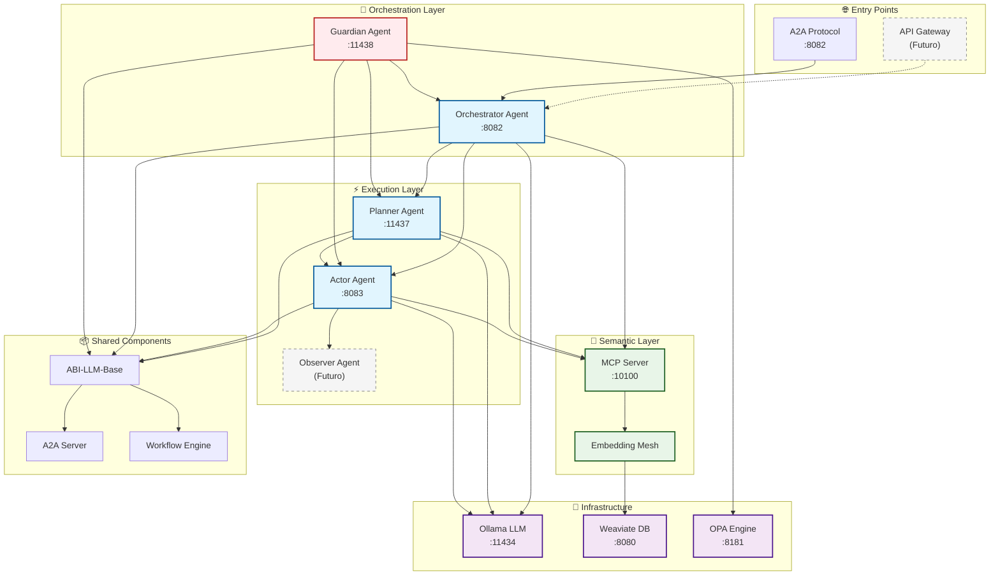

# 🚀 ABI - MVP Operativo

El MVP está completamente funcional usando `docker-compose.yml`.

---

## 🧩 Componentes Implementados

- ✅ **Orchestrator Agent** - Coordinación de workflows (Puerto 8082)
- ✅ **Planner Agent** - Planificación de tareas (Puerto 11437)
- ✅ **Actor Agent** - Ejecución de acciones (Puerto 8083)
- ✅ **Guardian Agent** - Seguridad y políticas (Puerto 11438)
- ✅ **Observer Agent** - Monitoreo (En desarrollo)
- ✅ **Semantic Layer** - MCP Server con embeddings (Puerto 10100)
- ✅ **Ollama LLM Base** - Modelos locales (Puerto 11434)
- ✅ **Weaviate** - Base de datos vectorial (Puerto 8080)
- ✅ **OPA** - Motor de políticas (Puerto 8181)
- ✅ **A2A Protocol** - Comunicación inter-agentes
- ✅ **Health Monitoring** - Endpoints de salud

---

## 📁 Estructura Actual del Sistema

```
abi-core/
├── agents/
│   ├── abi-llm-base/           # Base común para todos los agentes
│   │   ├── agent/              # Lógica base de agentes
│   │   ├── common/             # A2A server, executor, workflow
│   │   ├── opa/                # Políticas base
│   │   ├── mcp/                # Cliente MCP
│   │   └── agent_cards/        # Definiciones de agentes
│   ├── orchestrator/           # Coordinador principal
│   ├── planner/                # Planificador de tareas
│   ├── worker_actor/           # Ejecutor de acciones
│   ├── guardial/               # Agente de seguridad
│   │   ├── agent/              # Lógica del guardian
│   │   └── opa/                # Servidor OPA dedicado
│   └── worker-observer/        # Observador (futuro)
├── semantic_layer/             # Capa semántica
│   └── layer/
│       ├── mcp_server/         # Servidor MCP
│       └── embedding_mesh/     # Embeddings y Weaviate
├── testing/                    # Suite de pruebas
└── docker-compose.yml         # Orquestación completa
```


## 🏗️ Arquitectura del Sistema Actual



## 🔄 Flujo de Trabajo Actual

1. **Request A2A** → Orchestrator (:8082)
2. **Guardian** valida políticas y seguridad
3. **Orchestrator** consulta **MCP Server** para discovery
4. **Planner** descompone la tarea en subtareas
5. **Actor** ejecuta las acciones específicas
6. **Guardian** monitorea y audita cada paso
7. **Weaviate** proporciona contexto semántico
8. **OPA** valida políticas en tiempo real

## 🚀 Estado del MVP

- ✅ **Sistema Completamente Operativo**
- ✅ **Todos los Servicios Funcionando**
- ✅ **Health Checks Pasando**
- ✅ **Comunicación A2A Establecida**
- ✅ **Seguridad y Políticas Activas**
- ⏳ **Entry Point HTTP Simple** (Próxima implementación)

## 🌐 Endpoints y Puertos

### Servicios Principales
| Servicio | Puerto | Endpoint | Estado |
|----------|--------|----------|--------|
| **Orchestrator** | 8082 | `POST /` (A2A) | ✅ Activo |
| **Guardian** | 11438 | `GET /health` | ✅ Activo |
| **Planner** | 11437 | A2A Protocol | ✅ Activo |
| **Actor** | 8083 | `GET /health` | ✅ Activo |
| **Semantic Layer** | 10100 | `GET /health` | ✅ Activo |

### Infraestructura
| Servicio | Puerto | Endpoint | Estado |
|----------|--------|----------|--------|
| **Ollama LLM** | 11434 | `/api/tags` | ✅ Activo |
| **Weaviate** | 8080 | `/v1/.well-known/ready` | ✅ Activo |
| **OPA Engine** | 8181 | `/health` | ✅ Activo |

### Health Check Rápido
```bash
# Verificar todos los servicios
curl -s http://localhost:8181/health    # OPA
curl -s http://localhost:8080/v1/.well-known/ready  # Weaviate  
curl -s http://localhost:10100/health   # Semantic Layer
curl -s http://localhost:11438/health   # Guardian
curl -s http://localhost:8082/health    # Orchestrator
curl -s http://localhost:8083/health    # Actor
```

## 🔧 Comandos de Desarrollo

### Iniciar el Sistema
```bash
cd abi-core
docker-compose up -d
```

### Verificar Estado
```bash
docker-compose ps
docker-compose logs abi-guardial
```

### Parar el Sistema
```bash
docker-compose down
```

## 📋 Próximos Pasos

1. **Entry Point HTTP** - Implementar endpoint `/stream` simple
2. **Observer Agent** - Activar agente de monitoreo
3. **API Gateway** - Crear interfaz REST amigable
4. **Dashboard Web** - Interfaz de usuario
5. **PyPI Package** - Distribución como `abi-core`

---

*Última actualización: 7 de Octubre, 2025*  
*Sistema MVP completamente operativo* ✅