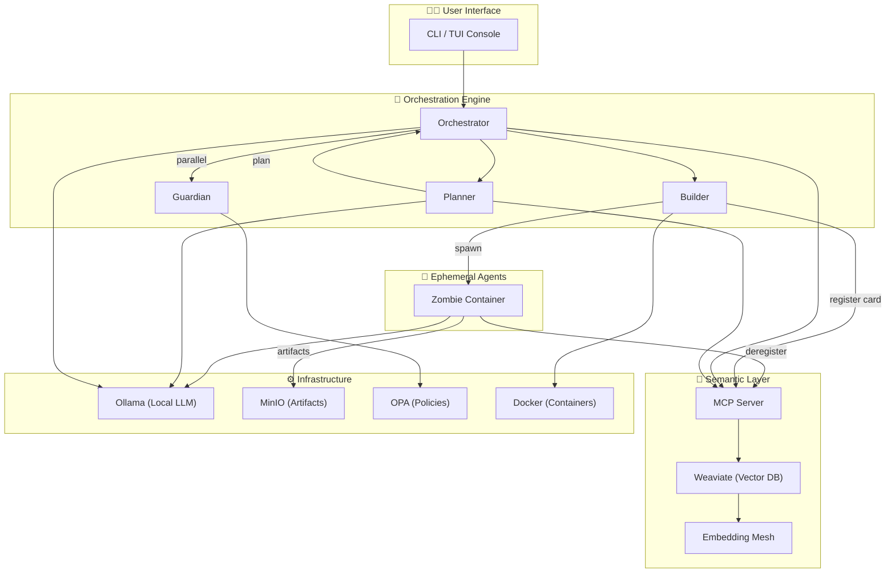

# ABI: Agent-Based Infrastructure for Democratizing Superintelligence

## Abstract

The way we interpret and utilize computing has radically changed. It is no longer just about processing data, but about reasoning, adapting, deciding, and acting. This new form of computation — more akin to a mind than a machine — is being centralized, governed, and distributed by a select few. Access to these cognitive capabilities is reserved for those who control massive resources: tech corporations, continent-scale governments, and private labs.

ABI (**Agent-Based Infrastructure**) represents the next evolutionary step in artificial intelligence: an infrastructure where cognitive load is distributed among agents, each capable of collaborating, reasoning, and learning. Built on a distributed reasoning model with consensus, ABI extends the capabilities of foundational models and transforms them into a human-supervised, auditable, and sensor-rich network.

This paradigm not only decentralizes computational power — it democratizes it. ABI enables universities, NGOs, open-source communities, and research centers to access distributed, scalable, and verifiable superintelligence.

ABI is now a functional open-source framework (`abi-core-ai`) with a complete end-to-end pipeline: natural language query → task decomposition → ephemeral agent creation → execution → artifact delivery → cleanup. All local-first, all governed by policy, all auditable.

---

## Context

### The Current Problem

Across both Eastern and Western tech worlds, a silent but decisive battle is being fought: to secure and control the resource that now defines digital leadership. This resource is not physical or financial — it is cognitive.

What is at stake is the capacity for intelligent processing and the infrastructure to think: to build, train, and deploy systems capable of reasoning, deciding, and acting autonomously or semi-autonomously. This capability is increasingly concentrated in ultra-centralized centers of computational power.

The result is clear: high-level AI becomes a reserved privilege, inaccessible to independent scientific communities, emerging countries, or actors with public and humanitarian goals.

### Limitations of Current Architectures

Most agent frameworks today solve a narrow problem: how to wire an LLM to tools. They operate as centralized graphs or crew definitions where agents are long-running processes with hardcoded tool lists. They depend on external API providers, offer no built-in governance, and treat security as an afterthought.

With the introduction of **MCP (Model Context Protocol)** and **A2A (Agent-to-Agent communication)**, a new possibility has emerged: agents that discover each other semantically, communicate bidirectionally, share distributed memory, and make networked decisions.

ABI is the architectural framework that channels this possibility toward a greater purpose: the democratization of superintelligence.

---

## Vision

ABI proposes a new way of thinking about AI: not as a closed, centralized system, but as a network of intelligences that collaborate, audit each other, and act within human-defined boundaries.

Cognition that is:

- **Distributed** — across multiple agents and ephemeral containers
- **Supervised** — with native human control and veto power
- **Audited** — with immutable logs and OPA-enforced governance
- **Composable** — each agent contributes a part of the whole
- **Local-first** — runs on your hardware, no data leaves your network

---

## ABI Orchestration Engine

At the heart of ABI lies the orchestration pipeline — a modular system that coordinates the entire multi-agent ecosystem. It is responsible for goal decomposition, semantic routing, agent creation, and policy enforcement.

The pipeline is composed of five primary agents:

1. **Orchestrator** — Central coordinator. Runs parallel triage (simple vs complex query) and Guardian security gate. Routes approved queries to the Planner. Builds execution workflows from plans. Synthesizes final results.

2. **Planner** — Decomposes natural language queries into structured plans with tasks, steps, dependencies, and model recommendations. Assigns agents via semantic search — if no agent exists, marks tasks for ephemeral creation.

3. **Builder** — Receives builder specs from the Orchestrator. Resolves required tools from the semantic layer. Generates ephemeral agent configuration. Spawns Docker containers with injected tools and agent cards. Registers the ephemeral agent in Weaviate.

4. **Guardian** — Security gate. Validates every request against OPA policies before execution. Detects prompt injection, reverse engineering attempts, and policy violations. Returns risk scores. Immutable core policies auto-generated at startup.

5. **Zombie (Ephemeral)** — Short-lived execution agent. Born in a Docker container, executes tasks with injected library tools, uploads artifacts to MinIO, self-deregisters from Weaviate, and the container self-destructs. No residual state.

### Decorator-Based DAG Pipelines

Each agent's pipeline is declared as a series of `@agent.task()` decorators that form a deterministic DAG. Dependencies and data flow are explicit — no LLM decides when to call them:

```python
agent = AbiCore()

@agent.task(name="classify_query", input_map={"query": "$input.query"})
async def classify_query(query):
    # Triage: simple or complex?
    ...

@agent.task(name="guardian_validate", input_map={"query": "$input.query"})
async def guardian_validate(query):
    # Security check via Guardian agent
    ...

@agent.task(name="gate_decision", depends_on=["classify_query", "guardian_validate"])
def gate_decision(triage, guardian, query):
    # Merge results, decide: respond_direct, call_planner, or blocked
    ...
```

Three decorator types enable different execution patterns:
- `@agent.task()` — Deterministic DAG step, strict topological order
- `@agent.tool()` — DAG step + LangChain tool (LLM can also invoke on demand)
- `@agent.mcp_tool()` — Remote MCP tool via MCPToolkit with HMAC auth

---

## Semantic Router + Embedding Mesh

ABI reaches its full potential when every agent publishes its capabilities as embeddings into the **Embedding Mesh** (Weaviate). When the **Semantic Router** queries this mesh, it instantly discovers the most relevant agent for a task, regardless of who that agent is or how it internally reasons.

This architecture enables:

- **Discovery** — agents are found by meaning, not by name or configuration
- **Delegation** — the right agent is selected automatically via `find_agent` MCP tool
- **Distributed Memory** — every agent card, tool card, and conclusion is stored as a persistent, searchable knowledge unit
- **Dynamic Registration** — ephemeral agents register on creation and deregister on completion

The Semantic Router does not need to know *who* the agent is — it only cares if semantically it can answer.

---

## Comparison with State-of-the-Art

The ABI Orchestration Engine plays a role analogous to cutting-edge orchestration mechanisms in large-scale AI platforms. However, ABI introduces key differentiators:

| Aspect | ABI-Core | Typical Agent Frameworks |
|--------|----------|------------------------|
| Orchestration | Semantic routing via embeddings | Hardcoded graphs or crew definitions |
| Agent lifecycle | Ephemeral containers — spawn, execute, die | Long-running processes |
| Model selection | Local-first (Ollama), vendor-agnostic | API-dependent (OpenAI, Anthropic) |
| Security | OPA policies + Guardian gate per request | App-level, if any |
| Auditability | Every selection decision is traceable | Varies |
| Governance | Immutable policies, human veto always | Not included |
| Tool discovery | Semantic search in Weaviate | Static tool lists |
| Deployment | `pip install` + `abi-core create swarm` | Manual setup |

In essence, ABI enables dynamic, context-aware, and vendor-agnostic cognitive orchestration — while keeping it open, transparent, and under the control of its community.

---

## Technical Architecture



---

## Monorepo Structure

```
packages/
  abi-core/       — Runtime library: agent framework, semantic, security, TUI, common utilities
  abi-agents/     — Agent implementations: orchestrator, planner, builder, zombie
  abi-services/   — Service templates: semantic layer, guardian (Jinja2 scaffolding)
  abi-cli/        — CLI commands + project scaffolding templates
abi-image/        — Docker base image with Ollama, agent cards, entrypoint scripts
.abi/             — Project metadata, specs, session logs, working rules
```

---

## License

Distributed under the [Apache License 2.0](https://www.apache.org/licenses/LICENSE-2.0).

## Credit

This whitepaper was authored by José Luis Martínez as part of the foundational definition of *Agent-Based Infrastructure (ABI)*. The framework is implemented as [abi-core-ai](https://pypi.org/project/abi-core-ai/) on PyPI.
