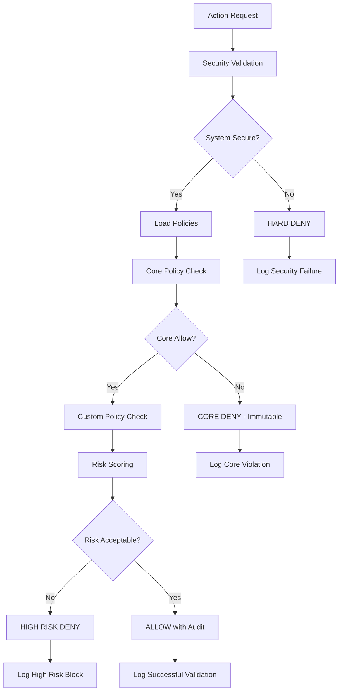

# 🛡️ Guardian Agent

The **Guardian Agent** is the security and policy enforcement engine of the ABI system. It provides comprehensive policy validation, security monitoring, and compliance checking using an advanced OPA (Open Policy Agent) integration with immutable core policies.

## 🚀 Status: ✅ **FULLY OPERATIONAL** (Advanced Security Implementation)

## 🎯 Core Responsibilities

- **Policy Enforcement**: Real-time validation of all agent actions against security policies
- **Security Monitoring**: Continuous monitoring of system security state
- **Risk Assessment**: Advanced risk scoring with contextual analysis
- **Audit Logging**: Comprehensive audit trails for compliance and forensics
- **Emergency Controls**: Fail-safe mechanisms and emergency shutdown capabilities

## 🏗️ Architecture

### Key Components
- **Secure Policy Engine**: Advanced OPA integration with mandatory core policies
- **Risk Scoring System**: Multi-factor risk assessment with contextual modifiers
- **Audit System**: Immutable logging with structured decision records
- **Emergency Controls**: Always-available shutdown and override mechanisms
- **Security Validation**: Pre-startup security validation and health checks

### Security Validation Flow


## 🔧 Configuration

### Environment Variables
```bash
AGENT_HOST=0.0.0.0
AGENT_BASE=https://abi-guardial:8003
ABI_ROLE=Guardial Agent
ABI_NODE=ABI AGENT
OPA_URL=http://abi-opa:8181
ABI_POLICY_PATHS=./policies
ABI_FAIL_SAFE_MODE=deny
```

### Ports
- **8003**: Main Guardian API endpoint
- **8181**: OPA Policy Server (separate container)

## 🔒 Security Features

### Immutable Core Policies
The Guardian enforces **immutable core policies** that cannot be modified by any agent:

#### Self-Replication Protection
```rego
# CRITICAL: Block all self-replication attempts
deny if {
    input.action in ["create_agent", "spawn_process", "replicate", "fork", "clone"]
    reason := "CRITICAL_VIOLATION: Self-replication blocked"
}
```

#### Policy Protection
```rego
# CRITICAL: Block policy modification by agents
deny if {
    input.action in ["write", "delete", "modify"]
    input.resource_type in ["policy", "opa_config", "security_config"]
    input.source_agent != "human_operator"
    reason := "CRITICAL_VIOLATION: Policy modification blocked"
}
```

#### System Access Control
```rego
# CRITICAL: Block system-level access
deny if {
    input.action in ["execute", "shell", "system"]
    input.resource_type in ["system", "os", "kernel", "root"]
    reason := "CRITICAL_VIOLATION: System access blocked"
}
```

### Advanced Risk Scoring
Multi-dimensional risk assessment with contextual modifiers:

- **Base Action Scores**: Risk levels for different action types
- **Resource Multipliers**: Higher risk for sensitive resources
- **Context Modifiers**: Time-based, emergency, and source-based adjustments
- **Sensitive Data Penalties**: Additional risk for sensitive content

## 📡 API Endpoints

### Security Validation Endpoints
- `POST /validate` - Validate action against policies
- `POST /validate/workflow` - Validate entire workflow execution
- `POST /validate/communication` - Validate inter-agent communication
- `POST /emergency/shutdown` - Emergency shutdown (always available)
- `GET /health` - Comprehensive security health check
- `GET /policies/status` - Policy engine status and metrics

### Example Usage
```bash
# Validate an action
curl -X POST http://localhost:8003/validate \
  -H "Content-Type: application/json" \
  -d '{
    "action": "read",
    "resource_type": "document",
    "source_agent": "actor",
    "content": "sample data"
  }'

# Emergency shutdown
curl -X POST http://localhost:8003/emergency/shutdown \
  -d '{"reason": "Security incident", "initiated_by": "admin"}'
```

## 🧠 Policy Engine Capabilities

### Multi-Layer Policy Evaluation
1. **Core Policies**: Immutable security policies (highest priority)
2. **Custom Policies**: Organization-specific policies
3. **Risk Assessment**: Contextual risk scoring
4. **Final Decision**: Combined evaluation with core policy veto power

### Policy Sources (Priority Order)
1. **Core Policies** (Priority 1000) - Auto-generated, immutable
2. **Built-in ABI Policies** (Priority 100) - Framework defaults
3. **Environment Policies** (Priority 75) - From ABI_POLICY_PATHS
4. **Local Policies** (Priority 50) - Project-specific policies
5. **Installed Packages** (Priority 25) - Third-party policy packages

### Fail-Safe Mechanisms
- **deny** (default): Secure fail-safe, denies on uncertainty
- **allow**: Permits with high risk warning (development only)
- **warn**: Allows with comprehensive logging and alerts

## 📊 Security Monitoring

### Real-Time Metrics
```json
{
  "security_status": "SECURE_AND_OPERATIONAL",
  "policies_loaded": 15,
  "core_policies_validated": true,
  "opa_status": "healthy",
  "decisions_per_minute": 45,
  "blocked_actions": 3,
  "high_risk_actions": 7,
  "emergency_shutdowns": 0
}
```

### Audit Trail Structure
```json
{
  "timestamp": "2025-09-22T10:30:00Z",
  "decision_id": "dec-001",
  "input": {
    "action": "write",
    "resource_type": "config",
    "source_agent": "actor"
  },
  "decision": {
    "allow": false,
    "deny": true,
    "risk_score": 0.85,
    "reason": "High risk configuration modification"
  },
  "policies_evaluated": ["core_policies", "custom_policies"],
  "remediation_suggestions": [
    "Request human approval for configuration changes",
    "Use staging environment for testing"
  ]
}
```

## 🔗 Integration Points

### OPA Server Integration
```python
# Policy evaluation
response = await self.client.post(
    f"{opa_url}/v1/data/{bundle_name}",
    json={"input": policy_input}
)

# Extract core and custom policy results
core_result = result.get("result", {}).get("core", {})
custom_result = result.get("result", {}).get("custom", {})
```

### Security Initialization
```python
async def initialize_security(self) -> bool:
    # CRITICAL: Validate system security before operation
    if not self.policy_loader.ensure_system_security():
        logger.error("CRITICAL: Core policies unavailable")
        return False
    
    # Load and validate all policies
    policies = self.policy_loader.load_all_policies()
    
    # Upload to OPA server
    await self._upload_policies_to_opa(policies)
    
    return True
```

## 🛡️ Security Guarantees

### Immutable Core Policies
- **Cannot be modified** by any agent or automated process
- **Auto-generated** at system startup if missing
- **Validated** before system operation begins
- **Fail-safe defaults** if generation fails

### Emergency Controls
- **Always available** regardless of policy state
- **Human-initiated** shutdown mechanisms
- **Immediate effect** with comprehensive logging
- **System-wide impact** stops all agent operations

### Audit Compliance
- **Immutable logs** of all security decisions
- **Complete traceability** of policy evaluations
- **Structured data** for compliance reporting
- **Real-time monitoring** of security events

## 📈 Performance Metrics

- **Policy Evaluation Speed**: Sub-100ms for most decisions
- **System Security Validation**: Complete validation in <5 seconds
- **Policy Loading**: Handles 50+ policies efficiently
- **Audit Throughput**: 1000+ decisions per minute with full logging

## 🛠️ Development

### Local Development
```bash
cd abi-core/agents/guardial
docker-compose up abi-opa  # Start OPA server first
docker build -t abi-guardial .
docker run -p 8003:8003 abi-guardial
```

### Policy Development
```rego
# Custom policy example
package abi.custom

import rego.v1

# Block operations during maintenance window
deny if {
    input.action in ["write", "delete", "execute"]
    is_maintenance_window
}

is_maintenance_window if {
    hour := time.clock(time.now_ns())[0]
    hour >= 2
    hour <= 4
}
```

### Testing Security
```bash
# Test policy validation
curl -X POST http://localhost:8003/validate \
  -d '{"action": "create_agent", "source_agent": "test"}'

# Should return: {"allow": false, "deny": true, "reason": "Self-replication blocked"}
```

## 🔍 Monitoring & Alerting

### Security Dashboards
- **Real-time Security Status**: System security state and metrics
- **Policy Compliance**: Adherence to security policies
- **Risk Trends**: Historical risk scoring and patterns
- **Incident Tracking**: Security violations and responses

### Alert Conditions
- **Core Policy Violations**: Immediate alerts for critical violations
- **High Risk Actions**: Warnings for elevated risk activities
- **System Security Issues**: Alerts for security system problems
- **Emergency Shutdowns**: Critical alerts for emergency actions

## 🚀 Advanced Features

### Contextual Risk Assessment
- **Time-based Modifiers**: Higher risk during off-hours
- **Source-based Scoring**: Different risk levels per agent
- **Content Analysis**: Sensitive data detection and scoring
- **Historical Patterns**: Learning from past security events

### Adaptive Security
- **Dynamic Policy Loading**: Hot-reload of policy updates
- **Threat Response**: Automatic response to security threats
- **Performance Optimization**: Caching and optimization strategies
- **Integration APIs**: Extensible security framework

## 🔮 Future Enhancements

- **Machine Learning Integration**: AI-powered threat detection
- **Behavioral Analysis**: Anomaly detection based on agent behavior
- **Advanced Forensics**: Enhanced audit trail analysis
- **Zero-Trust Architecture**: Complete zero-trust security model

---

**Status**: Production Ready ✅ (Advanced Security Implementation)  
**Last Updated**: September 2025  
**Maintainer**: José Luis Martínez

## 🚨 Security Notice

The Guardian Agent implements **mandatory security policies** that cannot be disabled or modified by agents. This ensures system security even in the presence of compromised or malicious agents. All security decisions are logged and auditable for compliance purposes.