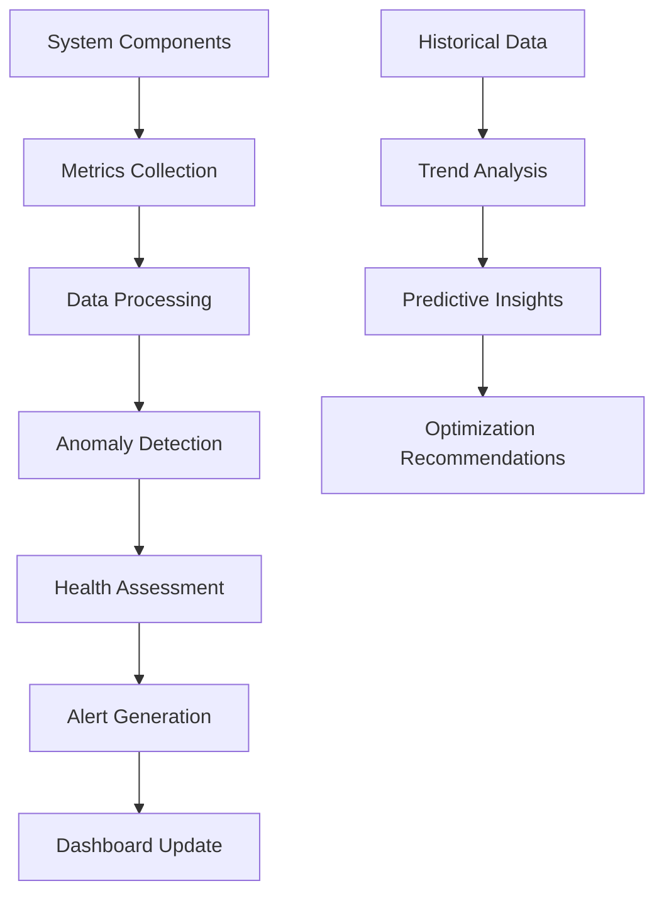

# 👁️ Observer Agent

The **Observer Agent** is responsible for system monitoring, performance analysis, and anomaly detection across the ABI multi-agent ecosystem. It provides comprehensive observability and insights to ensure optimal system operation.

## 🚀 Status: 🚧 **IN DEVELOPMENT** (Documentation Complete, Implementation Pending)

## 🎯 Core Responsibilities

- **System Monitoring**: Real-time monitoring of all agents and system components
- **Performance Analysis**: Collection and analysis of performance metrics
- **Anomaly Detection**: Identification of unusual patterns and potential issues
- **Health Checks**: Continuous health assessment of system components
- **Alerting**: Proactive notifications for system issues and anomalies

## 🏗️ Planned Architecture

### Key Components (To Be Implemented)
- **Metrics Collector**: Gathers performance data from all system components
- **Anomaly Detector**: ML-based detection of unusual system behavior
- **Health Monitor**: Continuous health assessment and reporting
- **Alert Manager**: Intelligent alerting with escalation policies
- **Dashboard Interface**: Real-time visualization of system state

### Monitoring Flow (Planned)


## 🔧 Planned Configuration

### Environment Variables (To Be Implemented)
```bash
AGENT_HOST=0.0.0.0
AGENT_BASE=https://abi-observer:11439
ABI_ROLE=Observer Agent
ABI_NODE=ABI AGENT
MONITORING_INTERVAL=30s
ALERT_THRESHOLD_CPU=80
ALERT_THRESHOLD_MEMORY=85
ALERT_THRESHOLD_RESPONSE_TIME=5000ms
```

### Ports (Planned)
- **11439**: Main Observer API endpoint
- **9090**: Metrics endpoint (Prometheus compatible)
- **3000**: Dashboard interface

## 📡 Planned API Endpoints

### Monitoring Endpoints (To Be Implemented)
- `GET /metrics` - Prometheus-compatible metrics endpoint
- `GET /health` - System health overview
- `GET /agents/status` - Status of all agents
- `GET /performance` - Performance metrics and trends
- `GET /alerts` - Active alerts and notifications
- `POST /alerts/acknowledge` - Acknowledge alerts
- `GET /dashboard` - Real-time dashboard data

### Example Usage (Planned)
```bash
# Get system health overview
curl http://localhost:11439/health

# Get performance metrics
curl http://localhost:11439/performance

# Get agent status
curl http://localhost:11439/agents/status
```

## 🔍 Monitoring Capabilities (Planned)

### System Metrics
- **Agent Performance**: Response times, throughput, error rates
- **Resource Usage**: CPU, memory, disk, network utilization
- **Workflow Metrics**: Execution times, success rates, bottlenecks
- **Security Events**: Policy violations, security incidents
- **Integration Health**: External service availability and performance

### Anomaly Detection
- **Statistical Analysis**: Deviation from normal patterns
- **Machine Learning**: Advanced pattern recognition
- **Threshold Monitoring**: Configurable alert thresholds
- **Trend Analysis**: Long-term trend identification
- **Predictive Analytics**: Forecasting potential issues

### Health Monitoring
- **Agent Availability**: Real-time agent status tracking
- **Service Dependencies**: Monitoring of critical dependencies
- **Performance Degradation**: Early detection of performance issues
- **Capacity Planning**: Resource utilization trends and forecasting

## 📊 Planned Data Collection

### Agent Metrics (To Be Collected)
```json
{
  "agent_id": "orchestrator",
  "timestamp": "2025-09-22T10:30:00Z",
  "metrics": {
    "requests_per_minute": 45,
    "average_response_time": 250,
    "error_rate": 0.02,
    "cpu_usage": 15.5,
    "memory_usage": 128,
    "active_workflows": 3,
    "queued_tasks": 7
  },
  "health_status": "healthy"
}
```

### System-Wide Metrics (To Be Collected)
```json
{
  "timestamp": "2025-09-22T10:30:00Z",
  "system_metrics": {
    "total_agents": 5,
    "active_agents": 4,
    "total_workflows": 15,
    "completed_workflows": 12,
    "failed_workflows": 1,
    "average_workflow_time": 45.2,
    "system_load": 0.65,
    "memory_utilization": 72.3,
    "disk_usage": 45.8
  }
}
```

## 🚨 Planned Alerting System

### Alert Types (To Be Implemented)
- **Critical**: System failures, security breaches
- **Warning**: Performance degradation, resource constraints
- **Info**: Completed workflows, system events
- **Anomaly**: Unusual patterns detected

### Alert Channels (Planned)
- **Dashboard**: Real-time dashboard notifications
- **Webhook**: HTTP callbacks for external systems
- **Email**: Email notifications for critical alerts
- **Slack**: Integration with team communication
- **PagerDuty**: Integration with incident management

### Alert Example (Planned Format)
```json
{
  "alert_id": "alert-001",
  "severity": "warning",
  "title": "High CPU Usage Detected",
  "description": "Actor agent CPU usage exceeded 80% threshold",
  "timestamp": "2025-09-22T10:30:00Z",
  "affected_component": "abi-actor",
  "metrics": {
    "current_cpu": 85.2,
    "threshold": 80.0,
    "duration": "5 minutes"
  },
  "recommended_actions": [
    "Check for resource-intensive tasks",
    "Consider scaling the actor agent",
    "Review recent workflow complexity"
  ]
}
```

## 🔗 Planned Integration Points

### Agent Integration (To Be Implemented)
```python
# Metrics collection from agents
async def collect_agent_metrics(self, agent_id: str) -> dict:
    agent_endpoint = f"http://{agent_id}:port/metrics"
    response = await self.http_client.get(agent_endpoint)
    return response.json()
```

### External Monitoring (Planned)
- **Prometheus**: Metrics collection and storage
- **Grafana**: Advanced visualization and dashboards
- **ELK Stack**: Log aggregation and analysis
- **Jaeger**: Distributed tracing for workflows
- **AlertManager**: Advanced alerting and routing

## 📈 Planned Performance Monitoring

### Key Performance Indicators
- **System Availability**: Uptime and availability metrics
- **Response Times**: End-to-end workflow execution times
- **Throughput**: Tasks processed per unit time
- **Error Rates**: Failure rates across different components
- **Resource Efficiency**: Optimal resource utilization

### Benchmarking (Planned)
- **Baseline Establishment**: Normal operation baselines
- **Performance Regression**: Detection of performance degradation
- **Capacity Planning**: Resource requirement forecasting
- **Optimization Opportunities**: Identification of improvement areas

## 🛠️ Development Plan

### Phase 1: Core Implementation (Planned)
```bash
# Basic monitoring infrastructure
- Metrics collection framework
- Health check endpoints
- Basic alerting system
- Simple dashboard
```

### Phase 2: Advanced Features (Planned)
```bash
# Advanced monitoring capabilities
- Anomaly detection algorithms
- Predictive analytics
- Advanced visualization
- Integration with external tools
```

### Phase 3: Intelligence Layer (Future)
```bash
# AI-powered monitoring
- Machine learning for anomaly detection
- Automated root cause analysis
- Self-healing capabilities
- Intelligent alerting
```

## 🔍 Planned Monitoring Scenarios

### Workflow Monitoring
- **Execution Tracking**: Monitor workflow progress and completion
- **Bottleneck Detection**: Identify workflow bottlenecks and delays
- **Success Rate Analysis**: Track workflow success and failure rates
- **Performance Optimization**: Suggest workflow optimizations

### Agent Health Monitoring
- **Availability Monitoring**: Track agent uptime and availability
- **Performance Monitoring**: Monitor agent response times and throughput
- **Resource Monitoring**: Track CPU, memory, and network usage
- **Error Monitoring**: Track and analyze agent errors and failures

### System-Wide Monitoring
- **Infrastructure Health**: Monitor underlying infrastructure
- **Service Dependencies**: Track external service dependencies
- **Security Monitoring**: Monitor for security events and anomalies
- **Compliance Monitoring**: Ensure system compliance with policies

## 🚀 Future Enhancements (Planned)

### Advanced Analytics
- **Machine Learning Integration**: AI-powered anomaly detection
- **Predictive Maintenance**: Predict and prevent system failures
- **Automated Optimization**: Self-optimizing system parameters
- **Intelligent Scaling**: Automatic resource scaling based on demand

### Enhanced Visualization
- **3D System Topology**: Interactive 3D visualization of system architecture
- **Real-time Heatmaps**: Visual representation of system performance
- **Custom Dashboards**: User-configurable monitoring dashboards
- **Mobile Interface**: Mobile-friendly monitoring interface

## 📋 Implementation Checklist

### Core Components
- [ ] Metrics collection framework
- [ ] Health monitoring system
- [ ] Basic alerting mechanism
- [ ] Simple dashboard interface
- [ ] Agent integration points

### Advanced Features
- [ ] Anomaly detection algorithms
- [ ] Predictive analytics engine
- [ ] Advanced visualization
- [ ] External tool integrations
- [ ] Automated response system

### Testing & Validation
- [ ] Unit tests for monitoring components
- [ ] Integration tests with other agents
- [ ] Performance testing of monitoring overhead
- [ ] Alerting system validation
- [ ] Dashboard usability testing

---

**Status**: 🚧 In Development (Priority P0)  
**Documentation**: Complete ✅  
**Implementation**: Pending 🚧  
**Target Completion**: 1 week  
**Last Updated**: September 2025  
**Maintainer**: José Luis Martínez

## 📝 Implementation Notes

The Observer Agent is the final component needed to complete the ABI multi-agent system. All documentation, architecture, and integration points have been defined. The implementation follows the established patterns used by other agents in the system and integrates seamlessly with the existing A2A protocol and MCP infrastructure.

**Next Steps**: 
1. Implement core monitoring framework
2. Add agent integration points
3. Create basic dashboard interface
4. Implement alerting system
5. Add comprehensive testing