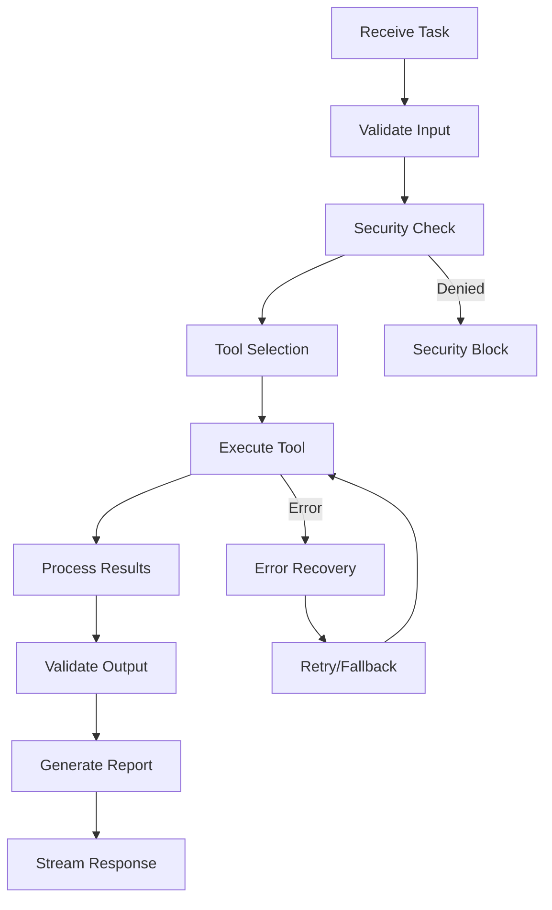

# ⚡ Actor Agent

The **Actor Agent** is the execution engine of the ABI system. It takes delegated tasks from the orchestrator and executes them using integrated tools, external APIs, and system resources while maintaining full context continuity and security compliance.

## 🚀 Status: ✅ **FULLY OPERATIONAL**

## 🎯 Core Responsibilities

- **Task Execution**: Executes concrete tasks delegated by the orchestrator
- **Tool Integration**: Interfaces with external APIs, databases, and system tools
- **Result Processing**: Structures and validates execution results
- **Context Preservation**: Maintains execution context across task boundaries
- **Error Handling**: Provides robust error recovery and reporting

## 🏗️ Architecture

### Key Components
- **A2A Protocol Integration**: Full agent-to-agent communication support
- **Tool Execution Engine**: Safe and controlled tool invocation
- **Result Processor**: Structured output generation and validation
- **Context Manager**: Maintains state across task executions
- **Security Layer**: Validates all operations against security policies

### Execution Flow


## 🔧 Configuration

### Environment Variables
```bash
MODEL_NAME=tinyllama:latest
AGENT_HOST=0.0.0.0
AGENT_BASE=https://abi-actor:8002
AGENT_CARD=/app/agent_cards/actor_agent.json
ABI_ROLE=Actor Agent
ABI_NODE=ABI AGENT
PYTHONPATH=/app
```

### Ports
- **8002**: Main A2A API endpoint
- **11436**: Ollama LLM service

## 📡 API Endpoints

### Core Endpoints (A2A Protocol)
- `POST /stream` - Execute task with streaming responses
- `POST /execute` - Synchronous task execution
- `GET /card` - Get agent card information
- `GET /health` - Health check endpoint
- `GET /tools` - List available tools and capabilities

### Example Usage
```bash
curl -X POST http://localhost:8083/stream \
  -H "Content-Type: application/json" \
  -d '{
    "task": "web_scraping",
    "parameters": {
      "url": "https://example.com",
      "selector": ".content"
    },
    "context_id": "execution-123",
    "task_id": "exec-001"
  }'
```

## 🛠️ Tool Integration

### Supported Tool Categories
- **Web Scraping**: Extract data from websites and APIs
- **Data Processing**: Transform and analyze structured data
- **File Operations**: Read, write, and manipulate files
- **Database Access**: Query and update database systems
- **API Calls**: Integrate with external REST/GraphQL APIs
- **System Commands**: Execute safe system operations

### Tool Execution Framework
```python
class ToolExecutor:
    async def execute_tool(self, tool_name: str, parameters: dict) -> dict:
        # Validate parameters
        validated_params = self.validate_inputs(parameters)
        
        # Security check
        if not self.security_check(tool_name, validated_params):
            raise SecurityError("Tool execution blocked by policy")
        
        # Execute with timeout and error handling
        result = await self.safe_execute(tool_name, validated_params)
        
        # Process and validate results
        return self.process_results(result)
```

### Security Integration
- **Policy Validation**: All tool executions validated against OPA policies
- **Parameter Sanitization**: Input validation and sanitization
- **Resource Limits**: Execution time and resource constraints
- **Audit Logging**: Complete audit trail of all executions

## 🧠 Execution Capabilities

### Task Types
- **Data Extraction**: Web scraping, API calls, file parsing
- **Data Transformation**: Format conversion, data cleaning, aggregation
- **Analysis Operations**: Statistical analysis, pattern recognition
- **Integration Tasks**: System integration, data synchronization
- **Reporting**: Generate structured reports and summaries

### Error Handling
- **Graceful Degradation**: Continues operation despite partial failures
- **Retry Logic**: Intelligent retry with exponential backoff
- **Fallback Strategies**: Alternative execution paths for failed operations
- **Error Reporting**: Detailed error information with remediation suggestions

### Result Processing
- **Structured Output**: Consistent JSON-formatted results
- **Data Validation**: Ensures output meets expected schemas
- **Quality Metrics**: Provides execution quality indicators
- **Artifact Generation**: Creates reusable execution artifacts

## 📊 Response Format

### Execution Result Structure
```json
{
  "execution_id": "exec-001",
  "status": "completed",
  "task_type": "web_scraping",
  "results": {
    "data": [...],
    "metadata": {
      "execution_time": "2.3s",
      "records_processed": 150,
      "quality_score": 0.95
    }
  },
  "artifacts": [
    {
      "type": "data_file",
      "location": "/tmp/scraped_data.json",
      "size": "2.1MB"
    }
  ],
  "performance_metrics": {
    "cpu_usage": "15%",
    "memory_usage": "128MB",
    "network_requests": 12
  }
}
```

## 🔗 Integration Points

### A2A Communication
```python
# Receive task from orchestrator
async def stream(self, query: str, session_id: str, task_id: str):
    # Parse task parameters
    task_params = self.parse_task(query)
    
    # Execute with streaming updates
    async for update in self.execute_task(task_params):
        yield {
            'response_type': 'progress',
            'content': update,
            'task_id': task_id
        }
```

### Tool Registry
- **Dynamic Discovery**: Automatically discovers available tools
- **Capability Mapping**: Maps tools to task requirements
- **Version Management**: Handles tool versioning and updates
- **Health Monitoring**: Monitors tool availability and performance

## 📈 Performance Metrics

- **Execution Speed**: Average task completion time < 30 seconds
- **Success Rate**: >98% successful task completion
- **Resource Efficiency**: Optimal CPU and memory utilization
- **Tool Reliability**: High availability of integrated tools

## 🛡️ Security Features

### Policy Enforcement
- **Pre-execution Validation**: All tasks validated against security policies
- **Resource Access Control**: Controlled access to system resources
- **Data Protection**: Sensitive data handling and protection
- **Audit Compliance**: Complete audit trail for compliance

### Safe Execution Environment
- **Sandboxing**: Isolated execution environment for tools
- **Resource Limits**: CPU, memory, and time constraints
- **Network Controls**: Restricted network access
- **File System Protection**: Controlled file system access

## 🛠️ Development

### Local Development
```bash
cd abi-core/agents/worker_actor
docker build -t abi-actor .
docker run -p 8083:8002 abi-actor
```

### Adding New Tools
```python
@tool_registry.register("custom_tool")
async def custom_tool(parameters: dict) -> dict:
    # Tool implementation
    result = await execute_custom_logic(parameters)
    return {"status": "success", "data": result}
```

### Testing
```bash
# Test tool execution
curl -X POST http://localhost:8083/execute \
  -d '{"tool": "web_scraper", "url": "https://example.com"}'

# Test streaming execution
curl -X POST http://localhost:8083/stream \
  -d '{"task": "data_analysis", "dataset": "sample.csv"}'
```

## 🔍 Monitoring

### Execution Metrics
- **Task Queue**: Number of pending and active tasks
- **Execution Times**: Distribution of task completion times
- **Error Rates**: Frequency and types of execution errors
- **Resource Usage**: CPU, memory, and network utilization

### Quality Assurance
- **Result Validation**: Automated quality checks on outputs
- **Performance Benchmarks**: Comparison against expected performance
- **Tool Health**: Monitoring of integrated tool availability
- **Security Compliance**: Validation of security policy adherence

## 🚀 Advanced Features

### Intelligent Tool Selection
- **Capability Matching**: Automatically selects best tool for task
- **Performance Optimization**: Chooses tools based on performance metrics
- **Load Balancing**: Distributes load across available tools
- **Fallback Mechanisms**: Alternative tools for failed executions

### Context-Aware Execution
- **State Preservation**: Maintains execution state across tasks
- **Dependency Tracking**: Manages task dependencies and prerequisites
- **Result Caching**: Caches results for improved performance
- **Learning from History**: Improves execution based on past performance

## 🔮 Future Enhancements

- **AI-Powered Tool Selection**: Machine learning for optimal tool choice
- **Predictive Caching**: Anticipate and pre-cache likely results
- **Advanced Parallelization**: Concurrent execution of independent tasks
- **Custom Tool Development**: Framework for creating domain-specific tools

---

**Status**: Production Ready ✅  
**Last Updated**: September 2025  
**Maintainer**: José Luis Martínez