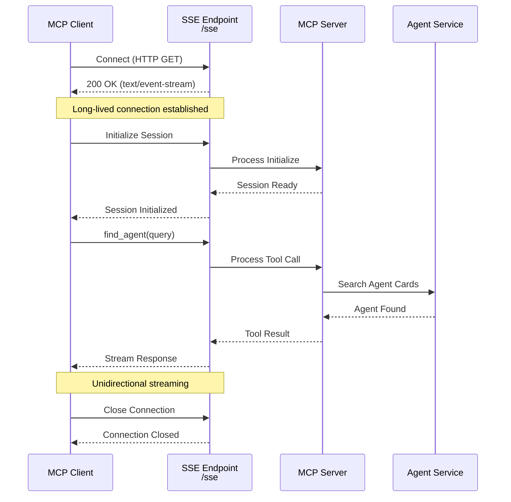
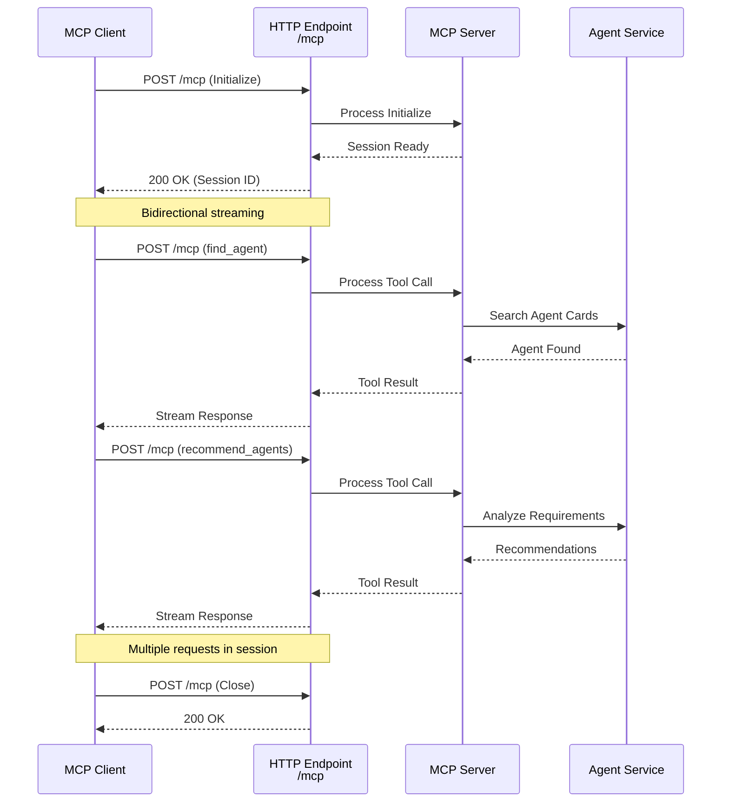
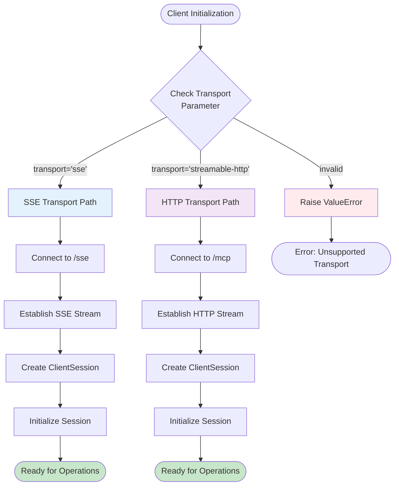
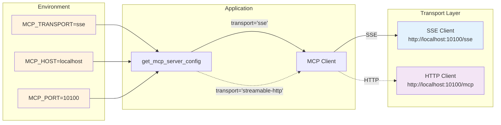
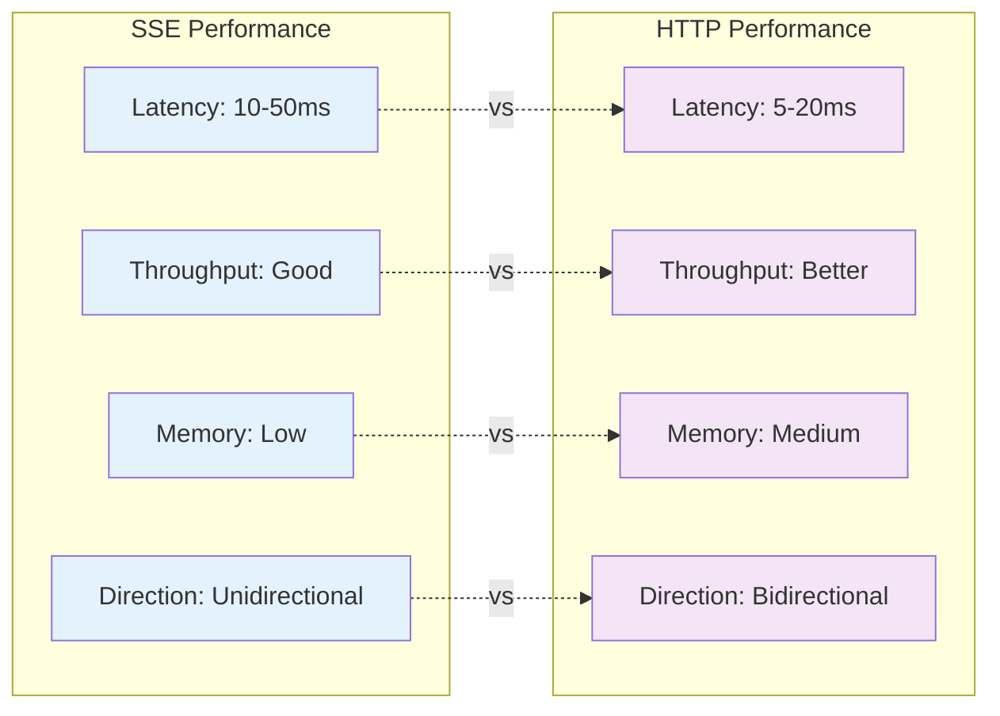
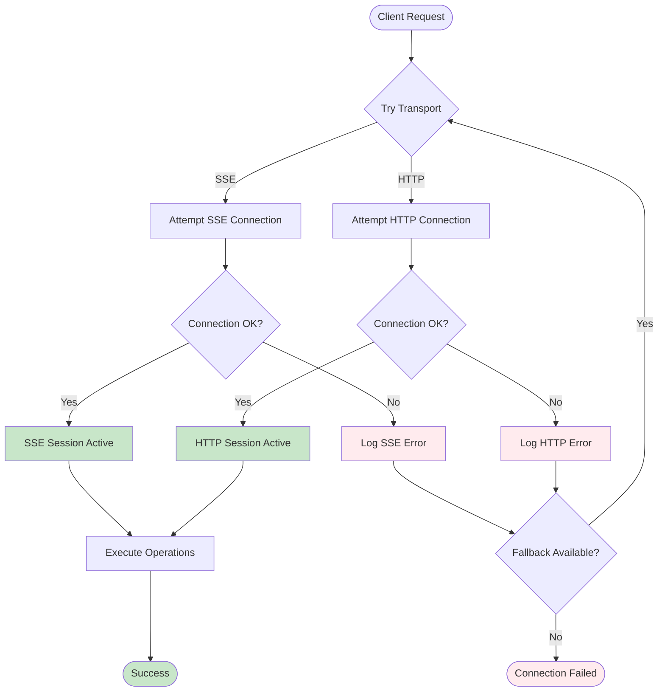
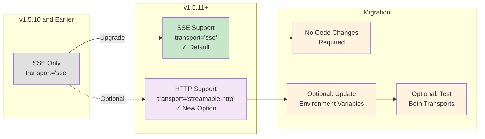

# MCP Transport Flow Diagrams

## SSE Transport Flow



## Streamable HTTP Transport Flow



## Transport Selection Logic



## Environment Configuration Flow



## Agent Communication Pattern

```mermaid
flowchart TD
    subgraph Orchestrator Agent
        OConfig[Config:<br/>MCP_TRANSPORT=sse]
        OClient[MCP Client]
    end
    
    subgraph Planner Agent
        PConfig[Config:<br/>MCP_TRANSPORT=sse]
        PClient[MCP Client]
    end
    
    subgraph Semantic Layer
        MCP[MCP Server]
        SSE[/sse endpoint]
        HTTP[/mcp endpoint]
    end
    
    subgraph Agent Registry
        Cards[(Agent Cards)]
        Weaviate[(Weaviate<br/>Vector DB)]
    end
    
    OConfig --> OClient
    PConfig --> PClient
    
    OClient -->|SSE| SSE
    PClient -->|SSE| SSE
    
    SSE --> MCP
    HTTP -.-> MCP
    
    MCP --> Cards
    MCP --> Weaviate
    
    style OConfig fill:#e8f5e8
    style PConfig fill:#e8f5e8
    style SSE fill:#e3f2fd
    style HTTP fill:#f3e5f5
    style Cards fill:#fff3e0
    style Weaviate fill:#fff3e0
```

## Performance Comparison



## Error Handling Flow



## Migration Path


